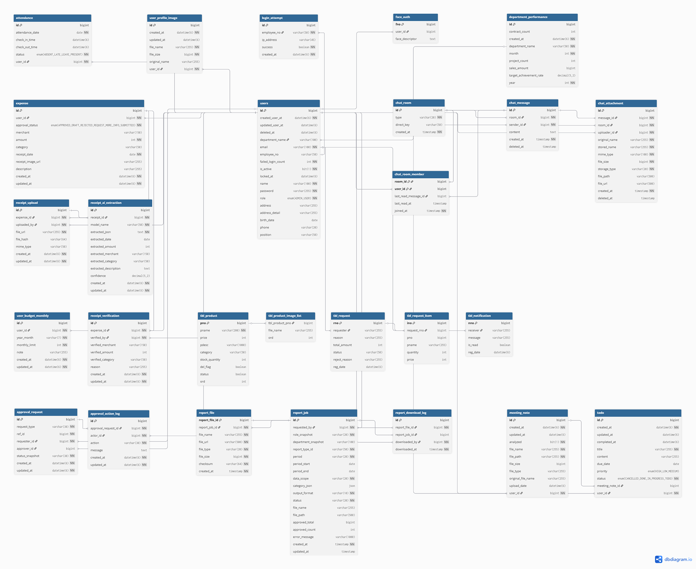
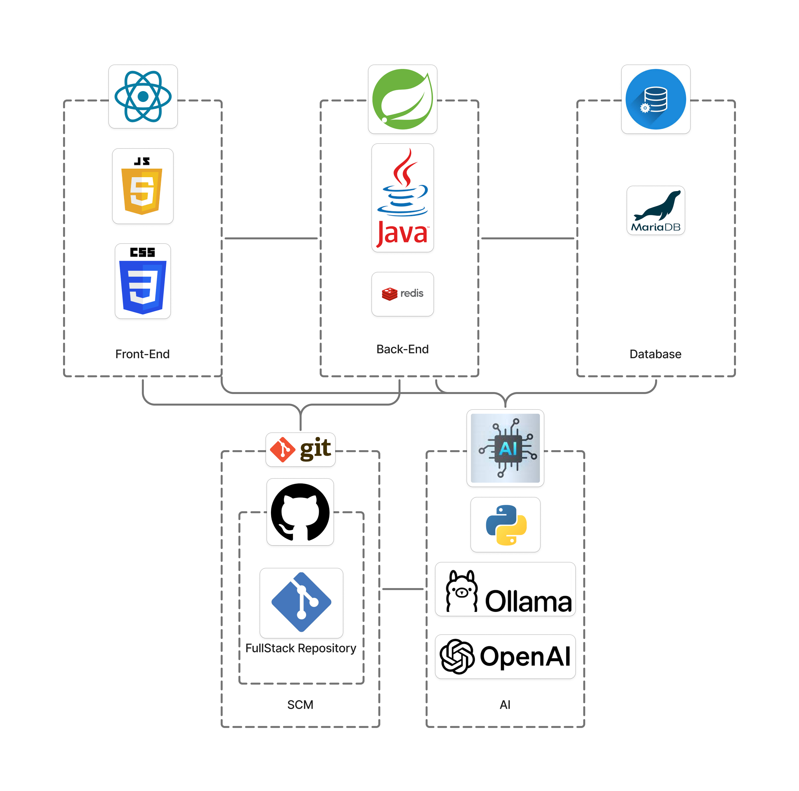
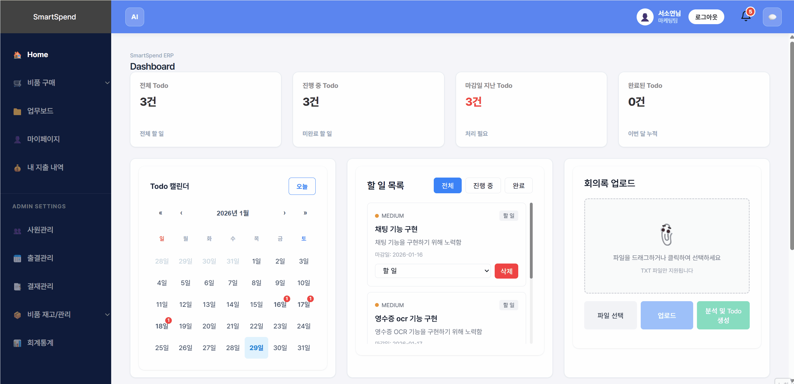
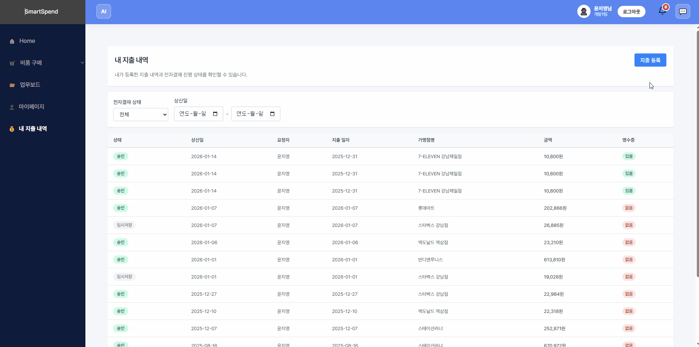
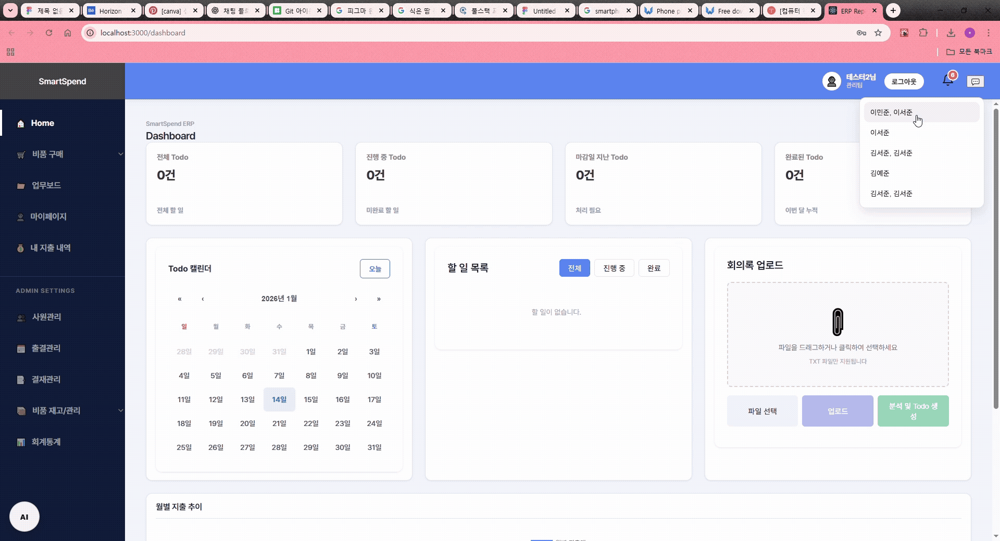
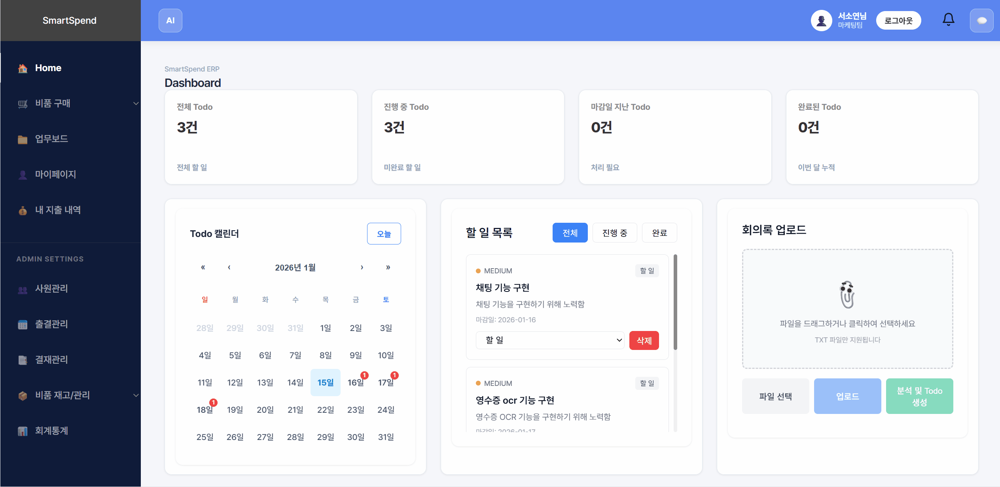
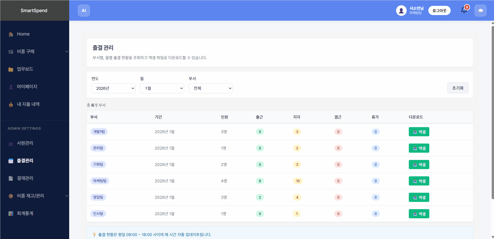

# 🏢 SmartSpend  
### AI 기반 RPA 사내 협업 시스템

> **단순 정보 제공이 아닌, AI가 실제 업무를 자동 처리하는 차세대 협업 플랫폼**

---

## 📅 프로젝트 개요

| 항목 | 내용 |
|------|------|
| 프로젝트명 | SmartSpend |
| 개발 기간 | 2025.12.15 ~ 2026.01.15 (5주) |

### 프로젝트 소개

**SmartSpend**는 기업 내 반복 업무(경비, 출결, 결재 등)로 인한 생산성 저하를 해결하기 위해 기획되었습니다.

기존 ERP의 수동 작업 한계를 넘어,  
**AI 챗봇 + RPA + OCR + 얼굴 인식** 기술을 결합하여  
자연어 명령만으로 업무를 자동 처리하는 **지능형 사내 협업 플랫폼**입니다.

---

## 🔗 프로젝트 자료

### 📘 Notion 기획서 & 문서

- 👉 [노션 바로가기](https://nettle-chips-f77.notion.site/1-2d001d6a12d5803db1b4def2b0478e9b?pvs=74)

### 🎥 시연 영상 (Demo Video)

- 👉 [영상 바로가기](https://youtu.be/D9-CwOcEv1w?si=bbBhQPHsbsgI2S9Z)

### 📚 프로젝트 자료

- 📄 발표 PDF: [다운로드](./images/1조_한해찬강진수문주연성건우전유진.pdf)

---

## 👥 팀 구성 (Team 1)

| 한해찬(팀장) | 강진수 | 문주연 | 성건우 | 전유진 |
|:--:|:--:|:--:|:--:|:--:|
|  |  |  |  |  |

---

## 📝 역할 분담 (R&R)

### 👤 한해찬 (팀장)
- 프로젝트 총괄 / 코드 통합 및 리팩토링 / AWS 및 Jenkins 배포
- AI(Ollama) Todo 자동화 CRUD 및 무한 스크롤
- Redux로 Todo상태 업데이트
- 메인 화면 반응형 UI 및 파일 업로드

### 👤 강진수
- 전체 레이아웃 / 알림 기능
- 비품 신청 · 승인 · 장바구니 CRUD
- face-api.js 얼굴 로그인
- 프로젝트 구현 영상 제작

### 👤 문주연
- 업무 보드 / WebSocket 실시간 채팅
- 채팅 파일 업로드 / AI 챗봇 연동
- DB 설계 / 일정 관리

### 👤 성건우
- Spring Security + JWT 인증
- 사원 관리 / 마이페이지 / 근태 관리
- 실적 AI 챗봇 / 회의록 정리

### 👤 전유진
- GPT-4o-mini Vision OCR
- AI 지출 승인 추천
- 지출 관리 시스템
- ERD / UseCase 제작

---

## 🛠 기술 스택

### Backend
- Java / Python  
- Spring Boot / FastAPI  
- Spring Security / JWT  
- JPA / Redis / WebSocket(STOMP)

### Frontend
- React / Redux Toolkit / JavaScript  
- Axios / SockJS  
- Chart.js / face-api.js

### Data & AI
- MariaDB / Redis  
- OpenAI / LangChain / Ollama  
- Pandas / OpenCV / NumPy

### Tools
- Git / GitHub / Figma  
- IntelliJ / VSCode / Cursor  
- Swagger / Postman  

### Server
- AWS
- Jenkins

---

## 🗂 ERD

---

## 🏗 Use Case Diagram

---

## 🏛 System Architecture

---

## 📱 반응형 UI

---

## ✨ 핵심 기능

---

### ① AI 회의록 → Todo 자동 생성

- 자연어 회의록 분석
- Todo / Calendar 자동 등록
- 마감 알림 연동

---

### ② 스마트 지출 결재

#### 영수증 OCR
- GPT Vision OCR
- LangChain 구조화
- Spring ↔ Python 연동

#### AI 승인 추천
- 패턴 분석
- APPROVE / REJECT 판단
- 사내 규정 Context 적용

---

### ③ 실시간 채팅 + AI 검색

- WebSocket 양방향 통신
- Semantic Search
- 파일 기반 검색

---

### ④ 근태 AI 챗봇

- 자연어 → 파라미터 추출
- Excel 자동 생성
- Matplotlib 시각화 + AI 보고서

---

### ⑤ 기타

- 얼굴 인식 로그인
- 실시간 대시보드

---

### ⑥ AWS + Jenkins

- 클라우드 가상환경(AWS)에 프로젝트 배포
- Jenkins로 CI/CD 환경 구축

---

## ✅ 요약

> **SmartSpend는 AI + RPA를 결합한 실제 업무 자동화 협업 플랫폼입니다.**

- 자연어 기반 업무 처리
- OCR + 결재 자동화
- 실시간 협업
- 데이터 분석 + 시각화
- 보안 인증까지 통합 구현

---

